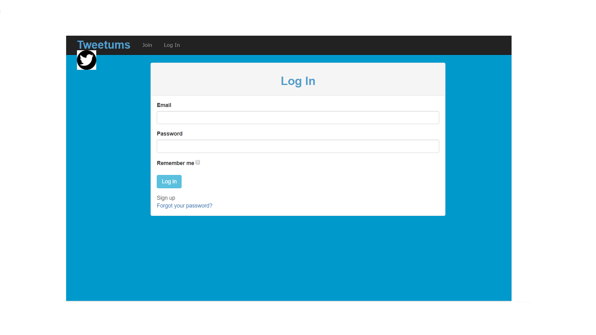

This is a basic app that looks functions and looks like twitter and instagram thus the name tweetagram. This was done using rails
* gems used: 
* gem 'haml'
* gem 'bootstrap-sass'
* gem 'simple_form'
* gem 'devise'
* gem 'paperclip'
* gem 'masonry-rails'
* gem 'acts_as_votable'
* gem 'font-awesome-rails'

FEATURES:
* login and register
* post or create new picture, view, update and delete 
* upvote by liking

INSTALL DEPENDENCIES:
* bundle install

MIGRATE DATABASE:
* rake db:migrate

RUN THE SERVER:
* rails s -p $PORT -b $IP

* LANDING PAGE

* REGISTRATION PAGE

* SHOW AND EDIT PAGE

