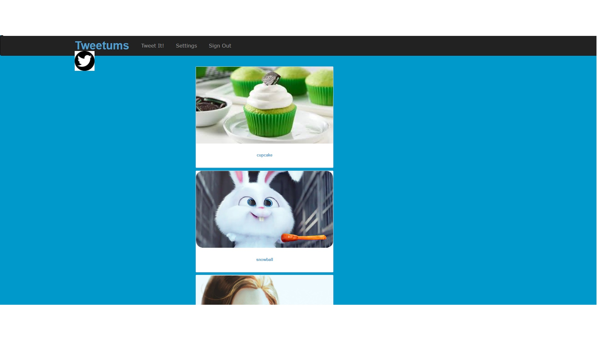

This is a basic app that looks functions and looks like twitter and instagram thus the name tweetagram. This was done using rails
* gems used: 
gem 'haml', '~> 5.0', '>= 5.0.2'
gem 'bootstrap-sass', '~> 3.3', '>= 3.3.7'
gem 'simple_form', '~> 3.5'
gem 'devise'
gem 'paperclip', '~> 4.2.0'
gem 'masonry-rails', '~> 0.2.4'
gem 'acts_as_votable', '~> 0.10.0'
gem 'font-awesome-rails', '~> 4.7', '>= 4.7.0

You can download or clone this then run bundle install. 

* LANDING PAGE

* REGISTRATION PAGE

* SHOW AND EDIT PAGE

